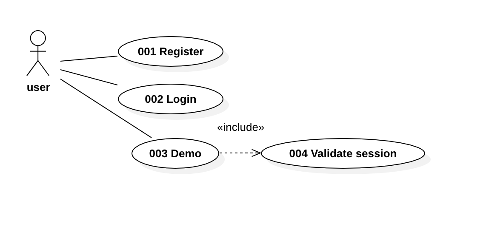
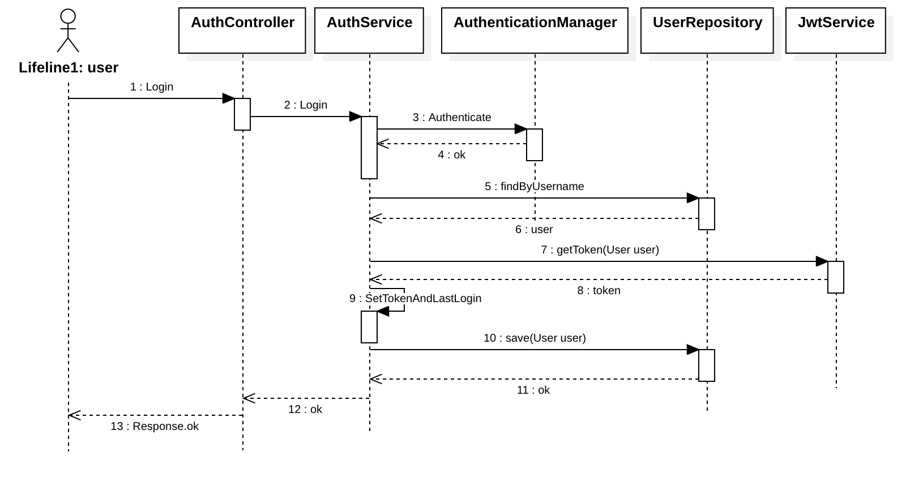
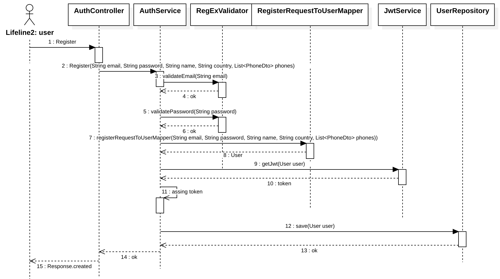

# PRUEBA BCI
Leonel Luengo

&nbsp;

## Funcionalidad 📄

Alta de usuario con generacion de token.

&nbsp;

## Documentación ⚙️

Usecase:

Sd Login:

Sd Register:

## Stack Tecnológico 🛠️

Herramientas
* [Spring boot](https://spring.io/projects/spring-boot) - Framework de java
* [Spring security](https://hibernate.org/](https://spring.io/projects/spring-security) - Framework para el manejo de seguridad.
* [Hibernate](https://hibernate.org/) - ORM. Mapear tablas a clases de Java
* [Junit5 y Mockito]() - Tests y Test de integración.

Metodología
* [Git Flow](https://www.atlassian.com/git/tutorials/comparing-workflows/gitflow-workflow) - Colaboración y versionado

## Entorno de Desarrollo 🚀

* ** Linux ubuntu 22.04
* ** Intellij Idea.
* ** Git
<<<<<<< HEAD
* ** Maven
=======
* ** Maven 4.0.0
>>>>>>> d84a2dbd8a84c1e6a5f53908eb4ac02b7a08a362
* ** Java 17

### Instalación 🔧

Descargar el proyecto.
<<<<<<< HEAD
Tener instalado maven y java 17

La aplicación correrá por defecto en localhost:8081

Para realizar pruebas podrá utilizar postman (json debajo) o swagger.

[localhost](http://localhost:8081/swagger-ui.html)
=======
Tener instalado gradle y java 17
>>>>>>> d84a2dbd8a84c1e6a5f53908eb4ac02b7a08a362

##### Instalar Lombok en el IDE

_Esto depende del IDE(1) que utilices, seguir indicaciones de la web de [Project Lombok](https://projectlombok.org/)_

##### Iniciar aplicación

    mvn spring-boot:run

## Ejecutando las Pruebas ⚙️
     
### Ejecutar tests para ver que esté todo en orden

    mvn verify

### Postman
    
* [import json](documentation/bci-postman.json)

## Autores ✒️

* **Leonel Luengo** - ** - [lluengo](https://github.com/lluengo/bci-2024)
&nbsp;
